# The Ultimate Java Syntax & Theory Cheat Sheet (Units 1–6)

> Comprehensive B.Tech CSE Notes with Theory, Syntax, Tables, Interview Tips, and Mermaid Diagrams

---

# Table of Contents

1. Java User Input & Environment Basics
2. Advanced Interfaces (Default & Static Methods)
3. Java Generics & Type Safety
4. Java Collections Framework
5. Multithreading & Thread Priorities
6. JDBC: PreparedStatement & ResultSet
7. Practical Programs & Logic Design
8. Quick Revision Sheet

---

# 1. Java User Input & Environment Basics

Java provides multiple methods for taking input depending on execution context.

---

## Input Methods Overview

| Method | Type | Usage | Advantage |
|---|---|---|---|
| Scanner | Console | Interactive input | Easy and beginner-friendly |
| BufferedReader | Console | Fast text input | High performance |
| Command Line Arguments | Console | Input before execution | Useful for automation |
| Console | Console | Secure input | Password masking |
| JOptionPane | GUI | Dialog boxes | User-friendly graphical input |

---

## Input Method Relationship Diagram

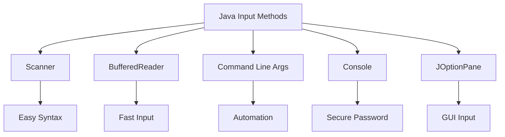

---

## Scanner Class

### Import Statement

```java
import java.util.Scanner;
```

### Creating Scanner Object

```java
Scanner s = new Scanner(System.in);
```

### Example Program

```java
import java.util.Scanner;

class Main
{
    public static void main(String[] args)
    {
        Scanner s = new Scanner(System.in);

        System.out.print("Enter Name: ");
        String n = s.nextLine();

        System.out.print("Enter Age: ");
        int a = s.nextInt();

        System.out.print("Enter GPA: ");
        double g = s.nextDouble();

        System.out.println("Name: " + n);
        System.out.println("Age: " + a);
        System.out.println("GPA: " + g);
    }
}
```

---

## Command Line Arguments

### Syntax

```java
class Main
{
    public static void main(String[] args)
    {

    }
}
```

### Example

```java
class Main
{
    public static void main(String[] args)
    {
        int a = Integer.parseInt(args[0]);
        int b = Integer.parseInt(args[1]);

        System.out.println(a + b);
    }
}
```

### Execution

```bash
javac Main.java
java Main 10 20
```

---

## Parsing Methods

| Method | Converts To |
|---|---|
| Integer.parseInt() | int |
| Double.parseDouble() | double |
| Float.parseFloat() | float |
| Long.parseLong() | long |
| Short.parseShort() | short |
| Byte.parseByte() | byte |
| Boolean.parseBoolean() | boolean |

---

## Important Note

```java
Boolean.parseBoolean("anything")
```

Returns:

```java
false
```

unless the string is `"true"`.

---

# 2. Advanced Interfaces (Java 8+)

Java 8 introduced:

- Default Methods
- Static Methods

These allow interfaces to evolve without breaking old code.

---

# Interface Evolution Diagram

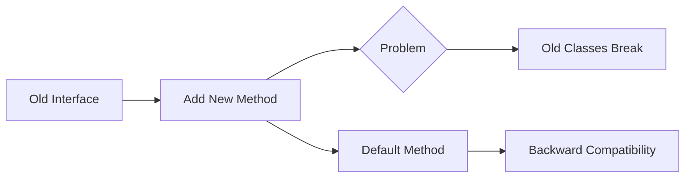

---

## Default Methods

### Syntax

```java
interface A
{
    default void show()
    {
        System.out.println("Hello");
    }
}
```

### Purpose

- Provides method body inside interface
- Prevents breaking existing implementations
- Supports backward compatibility

---

## Multiple Inheritance Conflict

If two interfaces contain same default method:

```java
interface A
{
    default void log()
    {
        System.out.println("A");
    }
}

interface B
{
    default void log()
    {
        System.out.println("B");
    }
}
```

Then implementing class must resolve conflict.

---

## Conflict Resolution

```java
class Test implements A,B
{
    public void log()
    {
        A.super.log();
    }
}
```

---

# Conflict Resolution Flow

```mermaid
flowchart TD
    A[Class Implements A and B]

    A --> B{Same Default Method?}

    B -->|Yes| C[Override Required]

    C --> D[A.super.method()]
```

---

## Static Methods in Interface

### Syntax

```java
interface A
{
    static void msg()
    {
        System.out.println("Hello");
    }
}
```

### Calling

```java
A.msg();
```

---

## Key Difference

| Default Method | Static Method |
|---|---|
| Called using object | Called using interface |
| Can be overridden | Cannot be overridden |

---

# 3. Java Generics & Type Safety

Generics provide:

- Compile-time type checking
- Reusability
- Elimination of casting

---

# Generic Type Flow

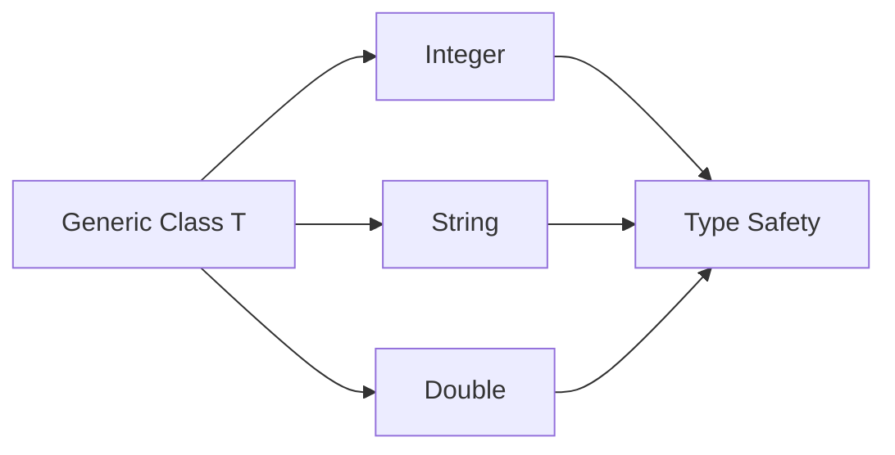

---

## Generic Class

```java
class Box<T>
{
    T data;

    void add(T d)
    {
        data = d;
    }

    T get()
    {
        return data;
    }
}
```

---

## Usage

```java
Box<Integer> b = new Box<Integer>();

b.add(10);

System.out.println(b.get());
```

---

## Generic Method

```java
public static <E> void show(E[] arr)
{
    for(E x : arr)
    {
        System.out.println(x);
    }
}
```

---

# Wildcards

| Wildcard | Name | Usage |
|---|---|---|
| <?> | Unbounded | Read-only |
| <? extends T> | Upper Bounded | Producer |
| <? super T> | Lower Bounded | Consumer |

---

# PECS Rule

```text
Producer -> Extends
Consumer -> Super
```

---

# Wildcard Hierarchy

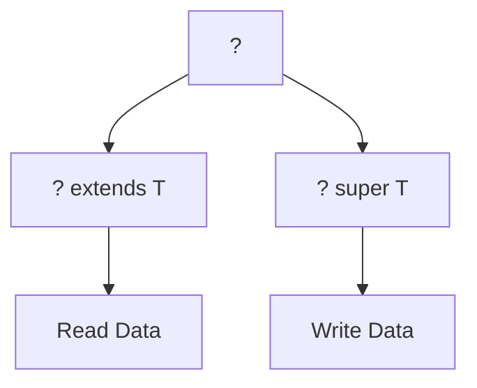

---

## Limitations of Generics

1. No primitive types
2. No generic arrays
3. No `new T()`
4. No static use of T
5. Type erasure removes type info at runtime

---

# 4. Java Collections Framework

Collections Framework provides standardized data structures.

---

# Collection Hierarchy

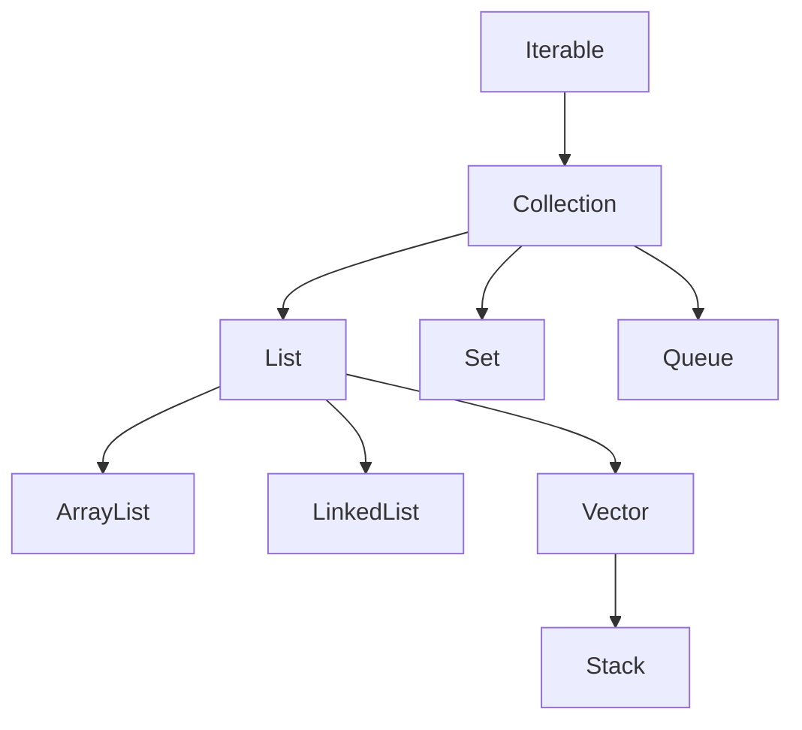

---

# List Implementations Comparison

| Property | ArrayList | LinkedList | Vector |
|---|---|---|---|
| Access | Fast | Slow | Fast |
| Insertion | Slow | Fast | Slow |
| Synchronization | No | No | Yes |
| Best Use | Frequent Reads | Frequent Writes | Legacy Threads |

---

# ArrayList Example

```java
import java.util.*;

class Main
{
    public static void main(String[] args)
    {
        ArrayList<String> a = new ArrayList<String>();

        a.add("Java");
        a.add("Python");

        System.out.println(a);
    }
}
```

---

# Stack Operations

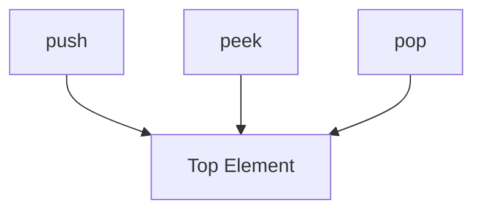

---

## Stack Methods

| Method | Purpose |
|---|---|
| push() | Insert |
| pop() | Remove |
| peek() | View top |
| empty() | Check empty |
| search() | Position |

---

## Stack Example

```java
Stack<Integer> s = new Stack<Integer>();

s.push(10);
s.push(20);

System.out.println(s.pop());
```

---

# Traversal Techniques

| Technique | Feature |
|---|---|
| for-loop | Index-based |
| Enhanced for | Simple |
| Iterator | Remove support |
| ListIterator | Bidirectional |
| Lambda forEach | Functional |
| Streams | Parallel support |

---

# Iterator Flow

```mermaid
flowchart LR
    A[Collection]
    A --> B[Iterator]

    B --> C[hasNext()]
    C --> D[next()]
```

---

# 5. Multithreading & Thread Priorities

Threads allow concurrent execution.

---

# Thread Lifecycle

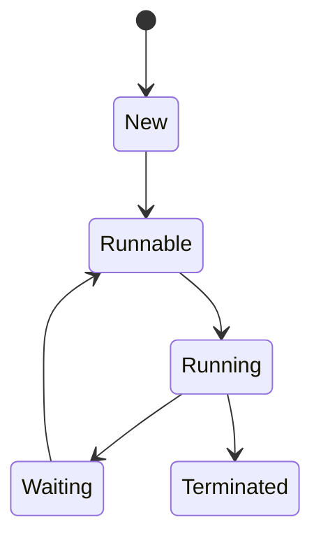

---

## Priority Constants

| Constant | Value |
|---|---|
| MIN_PRIORITY | 1 |
| NORM_PRIORITY | 5 |
| MAX_PRIORITY | 10 |

---

## Thread Methods

| Method | Purpose |
|---|---|
| setPriority() | Set priority |
| getPriority() | Get priority |
| start() | Start thread |
| sleep() | Pause thread |

---

## Example

```java
class MyThread extends Thread
{
    public void run()
    {
        System.out.println("Running");
    }
}

class Main
{
    public static void main(String[] args)
    {
        MyThread t = new MyThread();

        t.setPriority(8);

        t.start();
    }
}
```

---

## Important Notes

- Thread scheduler is platform dependent
- Priority is only a hint
- Invalid priority throws:

```java
IllegalArgumentException
```

---

# Thread Scheduling

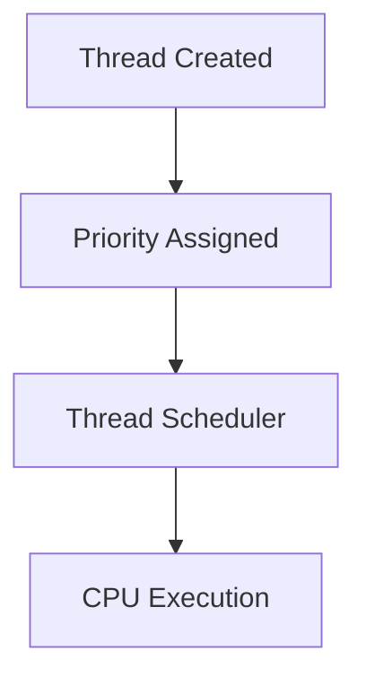

---

# 6. JDBC: PreparedStatement & ResultSet

JDBC connects Java applications to databases.

---

# JDBC Architecture

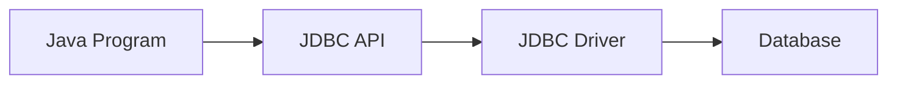

---

# Statement vs PreparedStatement

| Feature | Statement | PreparedStatement |
|---|---|---|
| SQL Injection | Vulnerable | Safe |
| Speed | Slow | Faster |
| Query Type | Static | Dynamic |

---

## PreparedStatement Example

```java
String q = "insert into emp(name,salary) values(?,?)";

PreparedStatement ps = con.prepareStatement(q);

ps.setString(1,"Amit");
ps.setDouble(2,55000);

ps.executeUpdate();
```

---

# SQL Injection Prevention

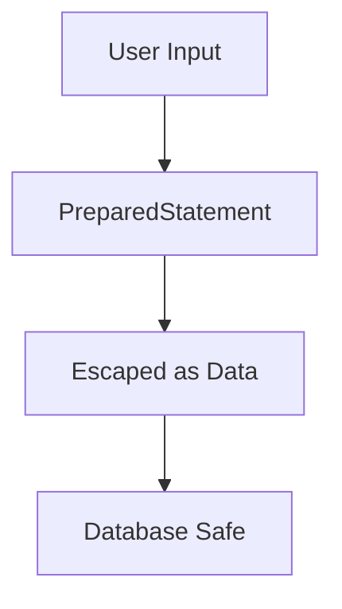

---

## ResultSet

### Important Points

- Cursor initially before first row
- Use `next()` to move
- Can retrieve data using:
    - getInt()
    - getString()
    - getDouble()

---

## Example

```java
ResultSet rs = st.executeQuery("select * from emp");

while(rs.next())
{
    System.out.println(rs.getInt(1));
}
```

---

# ResultSet Cursor Movement

```mermaid
flowchart LR
    A[Before First]
    A --> B[next()]
    B --> C[Row 1]
    C --> D[Row 2]
```

---

# 7. Practical Programs & Logic Design

---

# Student Result Processor

## Logic Flow

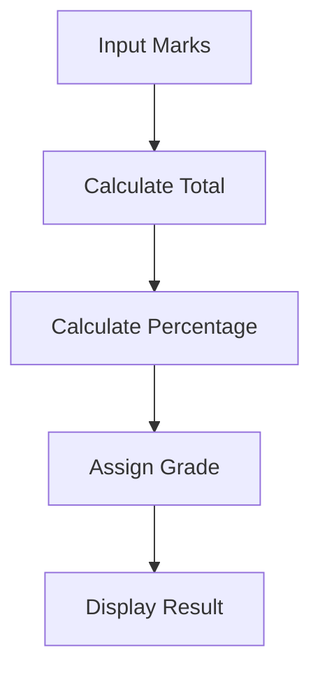

---

## Percentage Formula

```text
Percentage = Total Marks / 5
```

---

## Grade Logic

| Percentage | Grade |
|---|---|
| >=90 | A |
| >=75 | B |
| >=60 | C |
| >=40 | D |
| <40 | Fail |

---

# Temperature Converter

## Flowchart

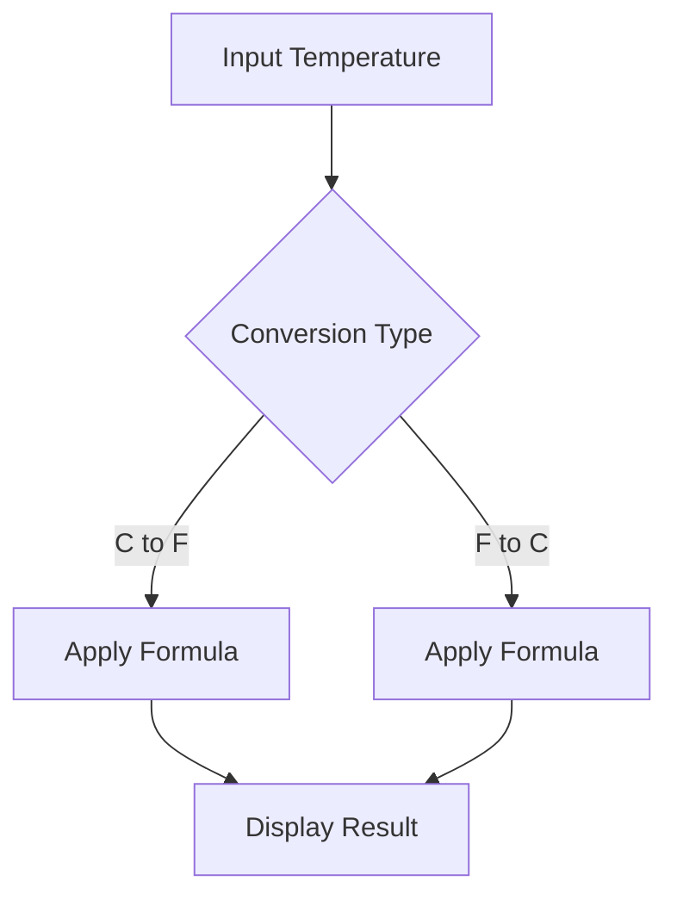

---

## Celsius to Fahrenheit

```text
F = (C * 9 / 5) + 32
```

---

## Fahrenheit to Celsius

```text
C = (F - 32) * 5 / 9
```

---

# 8. Quick Revision Sheet

---

## Scanner vs BufferedReader

| Scanner | BufferedReader |
|---|---|
| Slower | Faster |
| Parses primitives | Reads text only |
| Easy syntax | Complex syntax |

---

## ArrayList vs LinkedList

| ArrayList | LinkedList |
|---|---|
| Fast access | Fast insertion |
| Uses dynamic array | Uses nodes |

---

## Why PreparedStatement?

- Prevents SQL Injection
- Faster execution
- Supports dynamic queries

---

## Why Generics?

- Type safety
- Reusability
- Eliminates casting

---

## Why Default Methods?

- Backward compatibility
- Interface evolution

---

# Final One-Line Revision

- Scanner → Easy input
- Generics → Type safety
- Collections → Data structures
- Threads → Parallel execution
- JDBC → Database connectivity
- PreparedStatement → SQL security
- ResultSet → Retrieve rows

---

# End of Notes